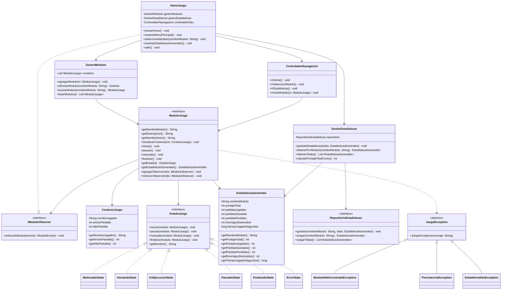
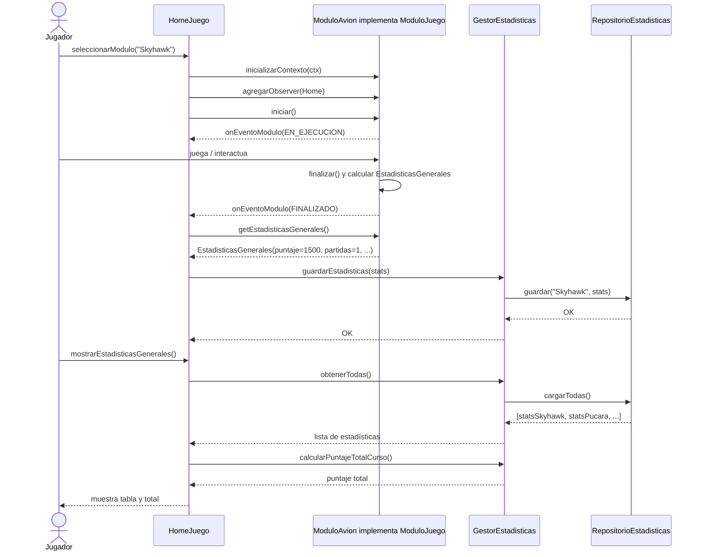
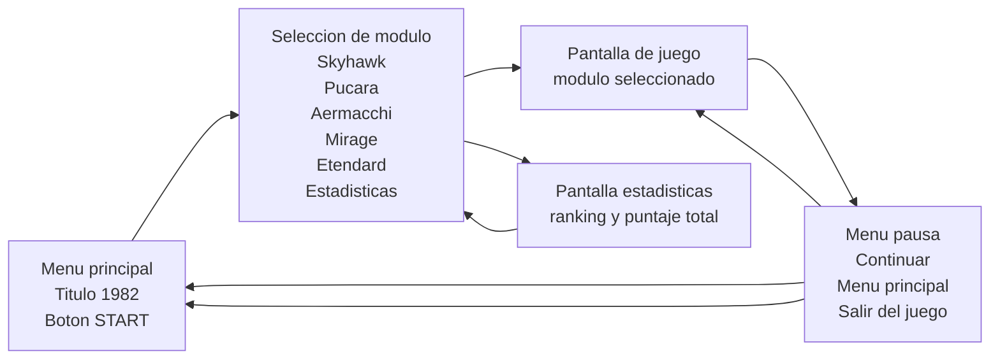

# AGENTS.md — Proyecto 1982 / Módulo 1: Menú Principal / Home-Lobby

Guía obligatoria para agentes de IA, integrantes del grupo y futuras contribuciones al repositorio `marcosbenson/Modulo_1_Algoritmos_1`.

Este archivo resume el material provisto para el TPI de Algoritmos 1 y lo convierte en reglas operativas para implementar, corregir y extender **solo el Módulo 1: Menú Principal / Home-Lobby** del proyecto **1982**. El foco principal es el **diagrama de clases del Home/Lobby**, la navegación, las estadísticas generales y el contrato mínimo necesario para integrarse con módulos de avión externos.

---

## 1. Objetivo del proyecto

El proyecto consiste en construir el **Menú Principal / Home-Lobby general** del videojuego arcade bidimensional **1982**. Este repositorio **no debe implementar el juego de ningún avión real**. Su responsabilidad es proveer la pantalla inicial, la selección de módulos, la navegación, la visualización de estadísticas generales y el contrato mínimo para que otros repositorios/grupos puedan conectar sus módulos de avión independientes.

El diseño debe priorizar:

- **Integrabilidad:** cada avión debe poder conectarse al Home sin acoplarse a detalles internos del lobby.
- **Escalabilidad:** deben poder agregarse nuevos módulos sin modificar el núcleo del Home.
- **Mantenibilidad:** las responsabilidades deben estar separadas por clases e interfaces.
- **Orientación a interfaces:** el contrato `ModuloJuego` es la frontera entre el Home y cada juego de avión.
- **Gestión de errores:** los errores relevantes deben clasificarse mediante una jerarquía de excepciones.
- **Persistencia de estadísticas:** cada módulo devuelve estadísticas generales y el Home las conserva para su visualización global.

El proyecto debe implementarse en **Java 8 o superior**, bajo POO, pero con una aclaración obligatoria: **todo lo implementado en este repositorio debe estar preparado para ejecutarse en Processing en Java**. Processing no es opcional para la interfaz del Home: el menú, la navegación, la pantalla de selección, estadísticas, carga de fuente y recursos visuales deben integrarse mediante el modelo de sketch de Processing (`PApplet`, `settings()`, `setup()`, `draw()` y eventos de teclado/mouse). No se permiten motores de juego ni frameworks externos que resuelvan la lógica principal.

### 1.1. Requisito técnico obligatorio: Processing en Java

Todo agente que implemente, modifique o refactorice este repositorio debe asumir que la aplicación final corre como un proyecto **Processing en Java**.

Reglas obligatorias:

- La aplicación visual del Home debe ejecutarse desde una clase/sketch que extienda `processing.core.PApplet`.
- La inicialización gráfica debe organizarse en `settings()` y `setup()`; el ciclo visual continuo debe resolverse en `draw()`.
- La entrada del usuario debe manejarse con callbacks de Processing, por ejemplo `keyPressed()`, `mousePressed()` o equivalentes.
- Las pantallas del Home pueden modelarse como clases propias, pero deben recibir el `PApplet` o una abstracción mínima de dibujo para no mezclar toda la lógica en una sola clase.
- Los gestores (`GestorModulos`, `GestorEstadisticas`, repositorios, estados y excepciones) deben seguir siendo Java puro siempre que sea posible. No deben depender de Processing si no dibujan ni leen eventos visuales.
- Las clases de vista sí pueden usar Processing (`PApplet`, `PFont`, `PImage`, funciones de dibujo, colores, texto y coordenadas).
- La fuente `PressStart2P-Regular` debe cargarse desde recursos de Processing, preferentemente dentro de `data/`, usando `createFont()` o `loadFont()` según la estrategia elegida.
- Los archivos de estadísticas pueden guardarse usando clases Java estándar o utilidades de Processing, pero el acceso debe seguir pasando por `RepositorioEstadisticas`.
- No implementar pantallas en Swing, JavaFX, consola interactiva o frameworks externos si reemplazan la UI principal de Processing.
- No introducir un motor de juego externo. Processing solo provee dibujo, recursos y eventos; la arquitectura del menú sigue siendo propia.

Modelo recomendado:

```java
import processing.core.PApplet;
import processing.core.PFont;

public class App1982 extends PApplet {
    private HomeJuego homeJuego;
    private PFont fuentePixel;

    public void settings() {
        size(800, 600);
    }

    public void setup() {
        fuentePixel = createFont("PressStart2P-Regular.ttf", 24);
        textFont(fuentePixel);
        homeJuego = new HomeJuego(this);
        homeJuego.iniciarHome();
    }

    public void draw() {
        background(0);
        homeJuego.dibujar();
    }

    public void keyPressed() {
        homeJuego.manejarTecla(key, keyCode);
    }

    public void mousePressed() {
        homeJuego.manejarClick(mouseX, mouseY);
    }

    public static void main(String[] args) {
        PApplet.main("App1982");
    }
}
```

La clase anterior es una guía de estructura. El punto importante es que **el repositorio no debe convertirse en una app Java genérica desconectada de Processing**.

### 1.2. Alcance estricto del repositorio

Este repositorio es **solo para el Menú Principal / Home-Lobby**. Para evitar confusiones de implementación, mantener esta frontera:

#### Dentro del alcance

- Pantalla de inicio del juego `1982`, dibujada en Processing.
- Menú principal con botón de inicio implementado en Processing.
- Pantalla de selección de módulos/aviones disponibles, renderizada con Processing.
- Pantalla de estadísticas generales agregadas, renderizada con Processing.
- Menú de pausa del Home o navegación de retorno, si aplica al flujo del lobby.
- Carga de fuente `PressStart2P-Regular` y recursos visuales del Home desde el flujo de recursos de Processing.
- `HomeJuego`, gestores, controlador de navegación, pantallas del Home y persistencia de estadísticas generales.
- Interfaces/contratos necesarios para conectarse con módulos externos (`ModuloJuego`, `EstadoJuego`, `IModuloObserver`, `RepositorioEstadisticas`, etc.), manteniendo la UI en Processing y la lógica desacoplada.
- Módulos falsos, mocks, fakes o stubs **solo para probar la integración del menú**, nunca como implementación real de Skyhawk, Pucará, Aermacchi, Mirage o Etendard.

#### Fuera del alcance

- Lógica jugable de aviones.
- Movimiento, disparos, enemigos, colisiones, niveles, física o sprites propios de cada avión.
- Estadísticas internas específicas de un avión, salvo datos generales recibidos por contrato.
- Recursos gráficos/sonoros completos de cada módulo de avión.
- Implementaciones concretas productivas como `AvionSkyhawk`, `AvionPucara`, `AvionMirage`, etc., excepto si se usan como mocks/stubs claramente marcados para demo o pruebas de integración del Home.
- Interfaces visuales principales en Swing, JavaFX o consola en lugar de Processing.

Cuando haya una duda, aplicar esta regla: **si pertenece al gameplay de un avión, no va en este repo; si pertenece a elegir, iniciar, volver, listar o mostrar estadísticas desde el Home, sí va en este repo.**


---

## 2. Material fuente usado para esta guía

- Enunciado del TPI de Algoritmos 1: videojuego 1982, documentación de análisis/diseño, código Java y defensa oral.
- Boceto de pantalla del Home: título `1982`, selección de aviones y entrada a estadísticas.
- Diagrama de clases general del Home/Lobby.
- Diagrama de clases detallado del contrato de integración.
- Diagrama de secuencia de integración de estadísticas entre Home, módulo de avión, gestor y repositorio.
- Diagrama de navegación GUI: menú principal, selección de módulo, juego y menú de pausa.
- Repositorio: `https://github.com/marcosbenson/Modulo_1_Algoritmos_1` — usarlo como repositorio del **Menú Principal / Lobby**, no como repositorio de implementación de aviones.
- Diagrama Mermaid indicado por el usuario: `https://mermaid.ai/d/129f0e8d-eb0e-491c-b113-9fd44488130c`
- Fuente visual indicada: `PressStart2P-Regular`.
- Aclaración técnica posterior del usuario: toda implementación debe apuntar a **Processing en Java**.
- Conceptos de diseño provistos por el usuario: SOLID, GRASP, MVC, Clean Code, excepciones, testing con JUnit, stubs/mocks, Git/Scrum y refactorización continua.

---

## 3. Reglas generales para agentes

### 3.1. Antes de modificar código

1. Leer este `AGENTS.md` completo.
2. Revisar el diagrama de clases de este archivo antes de crear o cambiar clases.
3. No cambiar firmas públicas de interfaces sin actualizar:
   - este archivo,
   - el diagrama Mermaid,
   - los módulos de avión que implementen el contrato,
   - la documentación de diseño.
4. Respetar el case exacto de rutas y paquetes existentes. En sistemas Linux, `Home`, `home`, `Contrato` y `contrato` son nombres diferentes.
5. Evitar mezclar responsabilidades: el Home coordina; los aviones juegan; el repositorio persiste; el gestor de estadísticas calcula y consulta.

### 3.2. Prohibiciones importantes

No hacer lo siguiente:

- No acoplar `HomeJuego` a clases concretas de aviones como `AvionSkyhawk`, `AvionPucara`, etc. El Home debe hablar con `ModuloJuego` y, dentro de este repositorio, esas clases solo deberían existir como mocks/stubs/fakes de integración si fueran necesarias.
- No guardar estadísticas directamente desde el módulo de avión. El módulo devuelve `EstadisticasGenerales`; el Home/Gestor se encarga de persistirlas.
- No usar variables globales para compartir estado entre Home y aviones.
- No lanzar `RuntimeException` genéricas cuando existe una excepción del dominio.
- No duplicar lógica de navegación en pantallas individuales si ya existe `ControladorNavegacion`.
- No modificar `EstadisticasGenerales` desde afuera si se define como objeto de datos inmutable.
- No introducir motores de juego externos que reemplacen la lógica principal ni reemplazar Processing como entorno visual principal.
- No subir archivos generados, compilados o temporales: `.class`, `out/`, `target/`, `.idea/`, `.vscode/`, logs, estadísticas locales de prueba si no corresponden.

### 3.3. Prioridad de diseño

Cuando haya dudas entre una solución rápida y una consistente con el diagrama, elegir la solución consistente con el diagrama. La evaluación del TPI valora especialmente diseño en POO, extensibilidad, mantenibilidad, argumentación de decisiones y coherencia entre documentación y código.

---

## 4. Arquitectura conceptual

El sistema se divide en cinco zonas principales. Todas deben entenderse desde el alcance del **Menú Principal / Home-Lobby** y desde la implementación obligatoria en **Processing en Java**:

1. **Home/Lobby**
   - Orquesta la aplicación.
   - Muestra pantallas.
   - Permite elegir módulos.
   - Recibe eventos de módulos.
   - Coordina estadísticas.

2. **Contrato de integración**
   - Define qué debe implementar cada módulo de avión externo para poder conectarse al Home.
   - Protege al Home de detalles concretos de cada juego.
   - Incluye ciclo de vida, contexto, estado, estadísticas y observadores.

3. **Estados de juego**
   - Modelan el ciclo de vida de un módulo.
   - Evitan transiciones inválidas.
   - Aplican el patrón **State**.

4. **Estadísticas y persistencia**
   - El módulo calcula estadísticas propias.
   - El Home recolecta estadísticas generales.
   - `GestorEstadisticas` centraliza lógica de acumulación/consulta.
   - `RepositorioEstadisticas` abstrae lectura/escritura.

5. **Interfaz gráfica y navegación**
   - El usuario entra por menú principal.
   - Luego selecciona avión o estadísticas.
   - Al jugar, el control pasa temporalmente al módulo.
   - Al finalizar o pausar, se vuelve al Home según corresponda.

---

## 5. Diagrama de clases — fuente de verdad del diseño

La siguiente vista es la versión consolidada que los agentes deben usar como referencia al implementar. Está centrada en el Home y en el contrato de integración entre el Home y los módulos de avión.



---

## 6. Descripción detallada de clases e interfaces

### 6.1. `HomeJuego`

`HomeJuego` es el **orquestador principal** del lobby. No debe implementar la lógica interna de un avión ni la persistencia concreta. Su función es coordinar gestores, navegación, pantallas y ciclo de vida de módulos.

Responsabilidades:

- Inicializar el Home.
- Mostrar el menú principal.
- Delegar la selección de módulos al `GestorModulos`.
- Delegar cambios de pantalla al `ControladorNavegacion`.
- Recibir eventos de módulos mediante `IModuloObserver`.
- Pedir estadísticas generales al módulo finalizado.
- Enviar estadísticas a `GestorEstadisticas`.
- Mostrar estadísticas globales.
- Finalizar la aplicación.

Atributos esperados:

```java
private GestorModulos gestorModulos;
private GestorEstadisticas gestorEstadisticas;
private ControladorNavegacion controladorNav;
```

Métodos esperados:

```java
public void iniciarHome();
public void mostrarMenuPrincipal();
public void seleccionarModulo(String nombreModulo);
public void mostrarEstadisticasGenerales();
public void salir();
```

Reglas:

- `seleccionarModulo` debe buscar por nombre, validar existencia e iniciar a través del controlador.
- Si el módulo no existe, lanzar o manejar `ModuloNoEncontradoException`.
- El Home debe registrar un observer en el módulo seleccionado para enterarse de eventos relevantes.
- Cuando el módulo finaliza, el Home debe consultar `getEstadisticasGenerales()` y llamar a `gestorEstadisticas.guardarEstadisticas(stats)`.
- No debe guardar archivos por sí mismo.

---

### 6.2. `GestorModulos`

`GestorModulos` administra la colección de módulos disponibles. Es el punto único para registrar, eliminar, buscar y listar módulos.

Responsabilidades:

- Mantener `List<ModuloJuego>`.
- Registrar módulos nuevos.
- Eliminar módulos por nombre.
- Buscar módulos por `getNombreModulo()`.
- Devolver una lista de módulos para la pantalla de selección.

Atributo esperado:

```java
private List<ModuloJuego> modulos;
```

Métodos esperados:

```java
public void agregarModulo(ModuloJuego modulo);
public boolean eliminarModulo(String nombreModulo);
public ModuloJuego buscarModulo(String nombreModulo);
public List<ModuloJuego> listarModulos();
```

Reglas:

- No debe conocer clases concretas de aviones salvo en una instancia de configuración inicial, si se decide centralizar el registro.
- No debe iniciar partidas; solo administra disponibilidad.
- `listarModulos` debe evitar exponer la lista mutable interna. Usar copia o vista inmodificable.
- `buscarModulo` debe comparar nombres de forma consistente. Recomendado: normalizar espacios y usar comparación case-insensitive solo si el criterio se documenta.
- Si no encuentra un módulo, puede retornar `null` solo si el resto del código lo maneja explícitamente; preferido: lanzar `ModuloNoEncontradoException`.

---

### 6.3. `ControladorNavegacion`

`ControladorNavegacion` concentra las transiciones entre pantallas y el paso de control hacia un módulo.

Responsabilidades:

- Ir al Home.
- Ir a selección de módulo.
- Ir a estadísticas.
- Iniciar un módulo elegido.

Métodos esperados:

```java
public void irHome();
public void irSeleccionModulo();
public void irEstadisticas();
public void iniciarModulo(ModuloJuego modulo);
```

Reglas:

- No debe calcular estadísticas.
- No debe buscar módulos; recibe el módulo ya resuelto.
- No debe conocer detalles internos de cada avión.
- Es el lugar correcto para mantener una variable de pantalla actual si se implementa una GUI con enum, por ejemplo `Pantalla.INICIO`, `Pantalla.SELECCION`, `Pantalla.ESTADISTICAS`, `Pantalla.JUEGO`.

---

### 6.4. `ModuloJuego`

`ModuloJuego` es la **interfaz más importante del proyecto**. Todo avión o módulo jugable debe implementarla. Es el contrato que garantiza que el Home pueda integrar juegos independientes.

Métodos de identidad:

```java
String getNombreModulo();
String getDescripcion();
String getNombreAvion();
```

Métodos de contexto:

```java
void inicializarContexto(ContextoJuego ctx);
```

Métodos de ciclo de vida:

```java
void iniciar();
void pausar();
void reanudar();
void finalizar();
```

Métodos de estado y estadísticas:

```java
EstadoJuego getEstado();
EstadisticasGenerales getEstadisticasGenerales();
```

Métodos de observación:

```java
void agregarObserver(IModuloObserver obs);
void removerObserver(IModuloObserver obs);
```

Reglas para implementadores de aviones:

- Cada avión debe ser autónomo en su lógica interna.
- Debe aceptar un `ContextoJuego` antes de iniciar.
- Debe mantener un `EstadoJuego` actual.
- Debe notificar eventos importantes al Home.
- Debe producir `EstadisticasGenerales` al finalizar.
- Debe manejar sus errores y convertir errores relevantes en `JuegoException` o subclases.
- Debe evitar depender de clases concretas del Home. Puede depender del contrato.

Eventos mínimos recomendados:

- `INICIADO`
- `PAUSADO`
- `REANUDADO`
- `FINALIZADO`
- `ERROR`

Nota: el diagrama menciona `ModuloEvento`, aunque no aparece como clase detallada. Si se implementa, debe ser un enum o clase simple que transporte tipo de evento, nombre del módulo, mensaje opcional y/o estadísticas opcionales.

---

### 6.5. `IModuloObserver`

Interfaz que aplica el patrón **Observer** para que el módulo avise al Home cambios relevantes.

Método esperado:

```java
void onEventoModulo(ModuloEvento evento);
```

Reglas:

- El módulo no debe llamar métodos concretos de `HomeJuego` directamente.
- El Home se registra como observer.
- El módulo notifica sin saber qué hará el Home con el evento.
- Ante evento `FINALIZADO`, el Home consulta estadísticas y las guarda.
- Ante evento `ERROR`, el Home debe volver al menú o mostrar una pantalla de error controlada.

---

### 6.6. `ContextoJuego`

Objeto de datos que el Home entrega al módulo antes de iniciar. Contiene información necesaria para configurar la partida.

Atributos esperados:

```java
private final String nombreJugador;
private final int anchoPantalla;
private final int altoPantalla;
```

Getters esperados:

```java
public String getNombreJugador();
public int getAnchoPantalla();
public int getAltoPantalla();
```

Reglas:

- Debe ser preferentemente inmutable.
- No debe contener referencias a objetos gráficos pesados si no son parte del contrato.
- No debe transportar gestores del Home.
- Si en el futuro se agrega dificultad, configuración de audio o controles, hacerlo agregando campos claros y documentados.

---

### 6.7. `EstadoJuego`

Interfaz del patrón **State**. Modela las transiciones posibles del ciclo de vida de cada módulo.

Métodos esperados:

```java
void iniciar(ModuloJuego modulo);
void pausar(ModuloJuego modulo);
void reanudar(ModuloJuego modulo);
void finalizar(ModuloJuego modulo);
String getNombre();
```

Estados concretos:

- `NoIniciadoState`
- `IniciandoState`
- `EnEjecucionState`
- `PausadoState`
- `FinalizadoState`
- `ErrorState`

Reglas generales:

- Cada estado decide qué transiciones son válidas.
- Una transición inválida debe lanzar `EstadoInvalidoException` o llevar a `ErrorState`, según decisión documentada.
- El módulo no debe tener un `switch` gigante de estados si se usa el patrón State.
- `FinalizadoState` debe tratarse como terminal.
- `ErrorState` permite que el Home detecte falla controlada y vuelva al menú.

Tabla recomendada de transiciones:

| Estado actual | iniciar | pausar | reanudar | finalizar |
|---|---|---|---|---|
| `NoIniciadoState` | válido → `IniciandoState`/`EnEjecucionState` | inválido | inválido | válido → `FinalizadoState` |
| `IniciandoState` | inválido | inválido | inválido | válido → `FinalizadoState` |
| `EnEjecucionState` | inválido | válido → `PausadoState` | inválido | válido → `FinalizadoState` |
| `PausadoState` | inválido | inválido | válido → `EnEjecucionState` | válido → `FinalizadoState` |
| `FinalizadoState` | inválido | inválido | inválido | inválido o idempotente documentado |
| `ErrorState` | inválido | inválido | inválido | válido solo para limpieza |

---

### 6.8. Estados concretos

#### `NoIniciadoState`

Representa un módulo creado y registrado pero todavía no ejecutado.

Debe permitir:

- `iniciar`
- opcionalmente `finalizar` para limpieza sin partida

Debe rechazar:

- `pausar`
- `reanudar`

#### `IniciandoState`

Representa carga de recursos, preparación de pantalla, inicialización de sprites, sonidos o variables.

Debe permitir:

- pasar a ejecución cuando finaliza la carga
- finalizar si la carga falla o el usuario cancela

Debe rechazar:

- iniciar otra vez
- pausar antes de estar en ejecución
- reanudar

#### `EnEjecucionState`

Representa partida activa.

Debe permitir:

- `pausar`
- `finalizar`

Debe rechazar:

- `iniciar`
- `reanudar`

#### `PausadoState`

Representa partida pausada.

Debe permitir:

- `reanudar`
- `finalizar`

Debe rechazar:

- `iniciar`
- `pausar` de nuevo

#### `FinalizadoState`

Representa partida terminada por victoria, derrota, salida o fin del módulo.

Debe permitir:

- consultar estadísticas
- liberar recursos si no se hizo antes

Debe rechazar:

- iniciar de nuevo el mismo objeto si no se documenta reinicio
- pausar
- reanudar

#### `ErrorState`

Representa falla controlada.

Debe permitir:

- informar error al Home
- volver al menú
- guardar estadísticas parciales solo si es seguro y está documentado

Debe rechazar:

- seguir jugando sin recuperación explícita

---

### 6.9. `GestorEstadisticas`

Clase de servicio del Home encargada de recibir, guardar, recuperar y agregar estadísticas generales.

Atributo esperado:

```java
private RepositorioEstadisticas repositorio;
```

Métodos esperados:

```java
public void guardarEstadisticas(EstadisticasGenerales stats);
public EstadisticasGenerales obtenerPorModulo(String nombreModulo);
public List<EstadisticasGenerales> obtenerTodas();
public int calcularPuntajeTotalCurso();
```

Reglas:

- Debe validar que `stats` no sea `null`.
- Debe usar `stats.getNombreModulo()` para saber a qué módulo pertenecen las estadísticas.
- Debe delegar persistencia en `RepositorioEstadisticas`.
- Debe calcular puntaje total del curso sumando los puntajes de todos los módulos cargados.
- Debe ser el único lugar para reglas de agregación estadística global.
- No debe dibujar pantallas.
- No debe iniciar módulos.

Ejemplo conceptual:

```java
public int calcularPuntajeTotalCurso() {
    int total = 0;
    for (EstadisticasGenerales stats : obtenerTodas()) {
        total += stats.getPuntajeTotal();
    }
    return total;
}
```

---

### 6.10. `EstadisticasGenerales`

Objeto de datos que cada módulo devuelve al Home. Debe representar solo estadísticas generales comparables entre módulos, no detalles internos específicos de cada avión.

Atributos esperados:

```java
private final String nombreModulo;
private final int puntajeTotal;
private final int partidasJugadas;
private final int partidasGanadas;
private final int partidasPerdidas;
private final int enemigosDestruidos;
private final long tiempoJugadoSegundos;
```

Getters esperados:

```java
public String getNombreModulo();
public int getPuntajeTotal();
public int getPartidasJugadas();
public int getPartidasGanadas();
public int getPartidasPerdidas();
public int getEnemigosDestruidos();
public long getTiempoJugadoSegundos();
```

Reglas:

- Debe ser preferentemente inmutable.
- Debe ser serializable si el repositorio usa serialización Java.
- No debe conocer el Home ni el repositorio.
- No debe mezclar estadísticas específicas del avión con estadísticas generales.
- Las estadísticas específicas del avión deben quedar dentro del módulo correspondiente.

Invariantes recomendadas:

- `partidasJugadas >= partidasGanadas + partidasPerdidas` si existen empates/abandonos.
- `puntajeTotal >= 0`, salvo que el diseño permita penalizaciones negativas.
- `tiempoJugadoSegundos >= 0`.
- `nombreModulo` no debe ser vacío.

---

### 6.11. `RepositorioEstadisticas`

Interfaz de persistencia. Abstrae dónde y cómo se guardan las estadísticas.

Métodos esperados:

```java
void guardar(String nombreModulo, EstadisticasGenerales stats);
EstadisticasGenerales cargar(String nombreModulo);
List<EstadisticasGenerales> cargarTodas();
```

Reglas:

- El Home no debe depender de una implementación concreta.
- El gestor usa la interfaz, no archivos directamente.
- Los errores de lectura/escritura deben transformarse en `PersistenciaException`.
- Si un módulo no tiene estadísticas guardadas, documentar si retorna objeto vacío, `null` o lanza excepción.
- Recomendado: implementar una clase concreta, por ejemplo `RepositorioEstadisticasArchivo`, para serialización o almacenamiento en texto/JSON simple.

---

### 6.12. Jerarquía de excepciones

#### `JuegoException`

Excepción base del dominio. Las excepciones del juego deben heredar de esta clase para que el Home pueda capturarlas de forma uniforme.

```java
public abstract class JuegoException extends Exception {
    public JuegoException(String mensaje) {
        super(mensaje);
    }
}
```

#### `ModuloNoEncontradoException`

Se usa cuando el usuario o el Home intentan seleccionar un módulo que no está registrado.

Casos típicos:

- `buscarModulo("Skyhawk")` no encuentra módulo.
- La lista de módulos está vacía.
- Se eliminó un módulo pero aún aparece en la UI.

#### `PersistenciaException`

Se usa cuando falla el guardado o carga de estadísticas.

Casos típicos:

- Archivo no accesible.
- Datos corruptos.
- Permisos insuficientes.
- Error de serialización.

#### `EstadoInvalidoException`

Se usa cuando se intenta una transición de estado no permitida.

Casos típicos:

- Pausar un módulo no iniciado.
- Reanudar un módulo en ejecución.
- Iniciar un módulo finalizado sin reinicialización.

---

## 7. Relaciones del diagrama y justificación

### 7.1. `HomeJuego --> GestorModulos`

El Home necesita listar y buscar módulos disponibles. Esta relación evita que la UI conozca directamente la colección de aviones.

### 7.2. `HomeJuego --> GestorEstadisticas`

El Home delega la persistencia y agregación de estadísticas. Esta separación mantiene a `HomeJuego` como orquestador y no como clase de cálculo.

### 7.3. `HomeJuego --> ControladorNavegacion`

El Home coordina la aplicación, pero las transiciones entre pantallas se centralizan en el controlador.

### 7.4. `HomeJuego ..|> IModuloObserver`

El Home observa a los módulos. Esto reduce acoplamiento: el módulo avisa eventos, pero no conoce la clase concreta del Home.

### 7.5. `GestorModulos --> ModuloJuego`

El gestor administra módulos a través del contrato. Permite agregar nuevos aviones sin cambiar la estructura central.

### 7.6. `ControladorNavegacion --> ModuloJuego`

El controlador puede iniciar un módulo sin saber si es Skyhawk, Pucará, Mirage u otro.

### 7.7. `ModuloJuego --> EstadoJuego`

Cada módulo tiene un estado actual. Las transiciones del ciclo de vida quedan encapsuladas.

### 7.8. `EstadoJuego <|.. Estados concretos`

Los estados concretos implementan el mismo contrato y encapsulan comportamientos por estado.

### 7.9. `GestorEstadisticas --> RepositorioEstadisticas`

El gestor define operaciones de negocio; el repositorio implementa acceso a datos.

### 7.10. `JuegoException <|-- Excepciones concretas`

La jerarquía permite capturar errores del dominio de forma uniforme y responder con mensajes controlados al usuario.

---

## 8. Flujo principal: seleccionar, jugar, finalizar y guardar estadísticas

Este flujo sale del diagrama de secuencia de integración de estadísticas.



Reglas del flujo:

1. El usuario elige un módulo en la pantalla de selección.
2. El Home busca el módulo con `GestorModulos`.
3. El Home crea `ContextoJuego`.
4. El Home inicializa el módulo con `inicializarContexto`.
5. El Home se registra como observer.
6. El Home inicia el módulo.
7. El módulo ejecuta su juego.
8. Al finalizar, el módulo calcula sus estadísticas generales.
9. El módulo notifica evento `FINALIZADO`.
10. El Home obtiene estadísticas.
11. El Home delega el guardado al gestor.
12. El gestor delega la persistencia al repositorio.
13. Cuando el usuario entra a estadísticas, el Home consulta todas y calcula el total del curso.

---

## 9. Navegación GUI esperada

El boceto de navegación muestra estas pantallas:



Reglas visuales:

- Estética pixel art de los años 80.
- Fondo oscuro o simple.
- Título `1982` grande.
- Usar fuente `PressStart2P-Regular` cuando esté disponible.
- Botones con textos claros y consistentes.
- La selección debe incluir módulos de avión y acceso a estadísticas.
- La pantalla de estadísticas debe mostrar estadísticas por módulo y total acumulado.

Textos de módulos esperados en la selección:

- `Skyhawk`
- `Pucará`
- `Aermacchi`
- `Mirage`
- `Etendard`
- Opcional/futuro: `Tutorial`

---

## 10. Estructura del repositorio y convenciones

Estructura conceptual esperada:

```text
1982/
├── README.md
├── AGENTS.md
├── .gitignore
├── data/
│   ├── PressStart2P-Regular.ttf
│   └── recursos_visuales_home/
├── docs/
│   ├── analisis/
│   ├── diseno/
│   └── manuales/
├── lib/
│   └── processing-core.jar
└── src/
    └── main/
        └── java/
            ├── App1982.java              # sketch principal: extends PApplet
            ├── Contrato/
            ├── Home/
            ├── Vista/                    # pantallas dibujadas con Processing
            └── Aviones/                  # solo stubs/fakes de integración, no gameplay real
```

En el repositorio actual se observan carpetas con mayúscula inicial (`Contrato`, `Home`, `Aviones`). No cambiar el casing sin migrar todo el proyecto y ajustar imports.

Convenciones recomendadas:

- Clases e interfaces en `PascalCase`.
- Métodos y variables en `camelCase`.
- Constantes en `UPPER_SNAKE_CASE`.
- Una clase pública por archivo.
- Nombres de archivos iguales al nombre de la clase pública.
- Comentarios Javadoc en interfaces y métodos públicos del contrato.

---

## 11. Paquetes recomendados

Si se agregan declaraciones `package`, decidir una estrategia y aplicarla a todo el código. Dos alternativas válidas:

### Alternativa A: respetar carpetas existentes

```java
package Contrato;
package Home;
package Aviones.AvionPrueba;
```

Ventaja: coincide con las carpetas actuales.
Desventaja: en Java se prefiere usar paquetes en minúscula.

### Alternativa B: migrar a paquetes Java convencionales

```java
package contrato;
package home;
package aviones.avionprueba;
```

Ventaja: estilo Java más estándar.
Desventaja: requiere renombrar carpetas y actualizar imports.

Regla: no mezclar ambas alternativas.

---

## 12. Organización recomendada para Processing

Aunque el proyecto sea Java, la ejecución visual debe organizarse como aplicación Processing.

### 12.1. Sketch principal

La clase principal recomendada es `App1982` o nombre equivalente. Debe extender `PApplet` y delegar el trabajo al Home:

- `settings()`: define tamaño de ventana y configuración de renderer.
- `setup()`: carga fuente, recursos y crea `HomeJuego`.
- `draw()`: limpia pantalla y delega el dibujo de la pantalla actual.
- `keyPressed()`: traduce input de teclado a acciones del Home.
- `mousePressed()`: traduce clicks a acciones del Home.
- `main()`: llama a `PApplet.main(...)`.

### 12.2. Separación entre Processing y dominio

Processing debe quedar principalmente en:

- `App1982`
- pantallas/vistas del menú
- componentes visuales como botones, texto, layouts y fondos
- carga de `PFont`, imágenes y recursos

Processing no debería aparecer en:

- `GestorModulos`
- `GestorEstadisticas`
- `RepositorioEstadisticas`
- `EstadisticasGenerales`
- estados (`EstadoJuego` y concretos)
- excepciones del dominio

Esta separación permite testear la lógica sin abrir una ventana gráfica.

### 12.3. Reglas para pantallas

Cada pantalla del Home debe tener responsabilidades visuales claras. Se recomienda una interfaz como:

```java
public interface PantallaHome {
    void dibujar(PApplet app);
    void manejarClick(int mouseX, int mouseY);
    void manejarTecla(char key, int keyCode);
}
```

Pantallas sugeridas:

- `PantallaInicio`
- `PantallaSeleccionModulo`
- `PantallaEstadisticas`
- `PantallaPausa`
- `PantallaError`

### 12.4. Recursos Processing

- Guardar `PressStart2P-Regular.ttf` en `data/` o en la carpeta de recursos que use el entorno.
- Cargar fuente una sola vez en `setup()` o en un cargador de recursos.
- Evitar cargar imágenes/fuentes dentro de `draw()` porque se ejecuta continuamente.
- Si falta un recurso, mostrar un fallback y registrar el error.

---

## 13. Integración de un nuevo módulo de avión externo o stub

Para integrar un avión nuevo en producción, el Home debe depender de una clase externa que implemente `ModuloJuego`. Dentro de este repositorio, crear una clase que implemente `ModuloJuego` solo está permitido como **stub/mock/fake de integración** para probar el menú principal.

Ejemplo conceptual:

```java
public class AvionSkyhawk implements ModuloJuego {
    private ContextoJuego contexto;
    private EstadoJuego estado;
    private final List<IModuloObserver> observers = new ArrayList<>();
    private EstadisticasGenerales estadisticas;

    @Override
    public String getNombreModulo() {
        return "Skyhawk";
    }

    @Override
    public String getDescripcion() {
        return "Avion Skyhawk de la Armada Argentina";
    }

    @Override
    public String getNombreAvion() {
        return "A-4Q Skyhawk";
    }

    @Override
    public void inicializarContexto(ContextoJuego ctx) {
        this.contexto = ctx;
    }

    @Override
    public void iniciar() {
        // validar contexto, cambiar estado y notificar
    }

    @Override
    public void pausar() {
        // delegar en estado
    }

    @Override
    public void reanudar() {
        // delegar en estado
    }

    @Override
    public void finalizar() {
        // calcular estadisticas y notificar FINALIZADO
    }

    @Override
    public EstadoJuego getEstado() {
        return estado;
    }

    @Override
    public EstadisticasGenerales getEstadisticasGenerales() {
        return estadisticas;
    }

    @Override
    public void agregarObserver(IModuloObserver obs) {
        observers.add(obs);
    }

    @Override
    public void removerObserver(IModuloObserver obs) {
        observers.remove(obs);
    }
}
```

Checklist de integración:

- Implementa todos los métodos de `ModuloJuego`.
- Devuelve nombre único en `getNombreModulo`.
- Recibe `ContextoJuego` antes de iniciar.
- Mantiene estado actual.
- Notifica eventos al Home.
- Calcula `EstadisticasGenerales` al finalizar.
- No escribe estadísticas directamente en archivos.
- No importa clases concretas de UI del Home.
- Se registra en `GestorModulos` durante la inicialización del Home, preferentemente como stub/fake si está dentro de este repositorio.

---

## 14. Gestión de estadísticas

### 14.1. Dos dimensiones de estadísticas

El TPI distingue dos dimensiones:

1. **Estadísticas propias del avión**
   - Se manejan dentro del módulo.
   - Pueden incluir métricas particulares como combustible, munición, tipo de enemigo, daño recibido, etc.
   - No son obligatorias para el Home.

2. **Estadísticas generales del juego**
   - Se devuelven al Home.
   - Deben ser comparables entre módulos.
   - Se representan con `EstadisticasGenerales`.

### 14.2. Estadísticas generales mínimas

Campos del diagrama:

- `nombreModulo`
- `puntajeTotal`
- `partidasJugadas`
- `partidasGanadas`
- `partidasPerdidas`
- `enemigosDestruidos`
- `tiempoJugadoSegundos`

### 14.3. Pantalla de estadísticas

La pantalla debe poder mostrar una tabla conceptual:

| Módulo | Puntaje | Jugadas | Ganadas | Perdidas | Enemigos destruidos | Tiempo |
|---|---:|---:|---:|---:|---:|---:|
| Skyhawk | 1500 | 1 | 1 | 0 | 12 | 180s |
| Pucará | 2200 | 2 | 1 | 1 | 20 | 300s |
| Total curso | 3700 | 3 | 2 | 1 | 32 | 480s |

El total de curso debe calcularse en `GestorEstadisticas`, no en la pantalla.

---

## 15. Persistencia

`RepositorioEstadisticas` debe permitir cambiar la tecnología de persistencia sin alterar `GestorEstadisticas` ni `HomeJuego`.

Implementaciones posibles:

- Archivo binario con serialización Java.
- Archivo de texto simple.
- JSON casero si no se agregan dependencias externas.
- CSV simple.

Recomendación para Algoritmos 1: usar una solución simple y explicable en defensa oral.

Reglas:

- Toda falla de persistencia se envuelve en `PersistenciaException`.
- El repositorio no debe dibujar UI.
- El repositorio no debe calcular totales.
- El repositorio no debe conocer estados del módulo.
- El repositorio debe ser testeable con datos de prueba.

---

## 16. Patrones de diseño usados

### 16.1. Strategy/Interface Contract

`ModuloJuego` permite que el Home trate todos los módulos por igual. Cada avión implementa su propia estrategia interna de juego.

Justificación:

- Reduce acoplamiento.
- Facilita agregar aviones.
- Permite integración por equipos.

### 16.2. State

`EstadoJuego` y sus clases concretas modelan el ciclo de vida del módulo.

Justificación:

- Evita condicionales extensos.
- Hace explícitas las transiciones válidas.
- Mejora trazabilidad de errores.

### 16.3. Observer

`IModuloObserver` permite que el módulo notifique al Home sin depender de él.

Justificación:

- Mantiene independencia de módulos.
- Permite reaccionar a eventos de fin/error/pausa.
- Facilita integrar módulos de distintos equipos.

### 16.4. Repository

`RepositorioEstadisticas` encapsula persistencia.

Justificación:

- Separa lógica de negocio y acceso a datos.
- Facilita cambiar de archivos a otra técnica.
- Simplifica pruebas.

---

## 17. Conceptos de diseño, implementación e integración obligatorios

Esta sección agrega explícitamente los conceptos de diseño que deben guiar el trabajo del Menú Principal. No reemplaza el diagrama de clases: lo complementa y explica cómo debe defenderse la arquitectura.

### 17.1. Principios arquitectónicos y diseño orientado a objetos

El diseño del Menú Principal no solo debe funcionar: debe ser **resiliente al cambio, extensible, mantenible e integrable** con módulos de avión hechos por otros grupos. Cada cambio de código debe poder justificarse usando principios de diseño OO.

#### 17.1.1. Principios SOLID

El diseño debe justificar su estructura mediante los cinco principios SOLID de Robert C. Martin:

- **Single Responsibility Principle (SRP):** cada clase debe tener una sola razón para cambiar. `GestorEstadisticas` cambia por reglas de estadísticas; `ControladorNavegacion` cambia por transiciones de pantalla; `GestorModulos` cambia por registro/búsqueda/listado de módulos. Evitar una “clase dios” que haga menú, dibujo, persistencia, selección, estadísticas y manejo de errores.
- **Open/Closed Principle (OCP):** el Home debe estar abierto a la extensión, pero cerrado a la modificación. Agregar un nuevo avión o stub no debería obligar a reescribir la orquestación de `HomeJuego`; debería bastar con registrar un nuevo `ModuloJuego`.
- **Liskov Substitution Principle (LSP):** cualquier módulo, mock, stub o implementación real que cumpla `ModuloJuego` debe poder sustituir a otro sin romper `HomeJuego`, `GestorModulos` ni `ControladorNavegacion`. Si una implementación exige precondiciones ocultas, lanza excepciones inesperadas o no respeta el ciclo de vida, viola el contrato.
- **Interface Segregation Principle (ISP):** mantener interfaces pequeñas, cohesivas y enfocadas. `ModuloJuego` debe contener lo mínimo necesario para integración; no debe llenarse de métodos específicos de un avión. Si aparece una necesidad visual o estadística específica, evaluar si pertenece al Home o al módulo externo.
- **Dependency Inversion Principle (DIP):** el Home, como módulo de alto nivel, no debe depender de implementaciones concretas de aviones o repositorios. Debe depender de abstracciones: `ModuloJuego`, `EstadoJuego`, `RepositorioEstadisticas` e `IModuloObserver`.

Aplicación directa al repo:

```java
// Bien: el Home depende del contrato
private List<ModuloJuego> modulos;

// Mal: el Home depende de aviones concretos reales
private AvionSkyhawk skyhawk;
private AvionPucara pucara;
```

#### 17.1.2. Patrones GRASP

Las responsabilidades deben asignarse siguiendo patrones GRASP:

- **Experto en Información:** asignar cada responsabilidad a la clase que posee la información necesaria. `GestorModulos` sabe qué módulos están registrados; `GestorEstadisticas` sabe cómo agregar estadísticas; `RepositorioEstadisticas` sabe cómo cargar/guardar datos.
- **Alta Cohesión:** cada clase debe concentrarse en una tarea clara. Las pantallas dibujan y capturan eventos; los gestores gestionan lógica; los repositorios persisten; los estados validan transiciones.
- **Bajo Acoplamiento:** minimizar dependencias entre Home, módulos externos y bibliotecas. La excepción permitida para GUI es Processing, pero debe quedar aislada en las clases visuales o en el sketch principal.
- **Controlador:** `ControladorNavegacion` debe actuar como punto central para recibir intención de la interfaz gráfica y delegar el trabajo. La vista no debería iniciar módulos, guardar estadísticas ni buscar repositorios directamente.

#### 17.1.3. Reglas adicionales de diseño

- **Composición sobre herencia:** preferir componer objetos en lugar de crear jerarquías profundas. Por ejemplo, una pantalla puede tener botones, fuente y controlador; no necesita heredar de varias clases abstractas.
- **MVC funcional:** mantener separación estricta entre Modelo, Vista y Controlador.
  - Modelo: `GestorModulos`, `GestorEstadisticas`, `EstadisticasGenerales`, estados, repositorios.
  - Vista: pantallas dibujadas con Processing.
  - Controlador: `ControladorNavegacion` y handlers que traducen eventos de Processing a acciones del Home.
- **Processing aislado:** Processing debe estar en la capa visual. La lógica testeable no debe depender de `PApplet` salvo que sea estrictamente necesario.
- **Contratos antes que clases concretas:** si dos grupos integran módulos, el contrato manda. Los nombres de métodos, estados y estadísticas generales deben mantenerse estables.

---

### 17.2. Normas de implementación y Clean Code

Para facilitar mantenimiento y comprensión entre integrantes y grupos, el código debe seguir reglas de Clean Code.

#### 17.2.1. Nomenclatura y estructura

- **Nombres significativos:** evitar abreviaturas irreconocibles. Usar `GestorEstadisticas`, `ControladorNavegacion`, `seleccionarModulo`, `mostrarEstadisticasGenerales`, etc.
- **Clases como sustantivos:** `HomeJuego`, `GestorModulos`, `PantallaSeleccionModulo`.
- **Métodos como verbos o frases verbales:** `iniciarHome`, `guardarEstadisticas`, `calcularPuntajeTotalCurso`, `manejarClick`.
- **Funciones pequeñas:** cada método debe hacer una sola cosa. Evitar métodos `draw()` o `setup()` de cientos de líneas. El `draw()` principal debería delegar en la pantalla actual.
- **Comentarios útiles:** comentar el porqué de una decisión arquitectónica, no repetir el qué hace el código. No subir código comentado de pruebas viejas, por ejemplo `// codigo_viejo()`.

Ejemplo recomendado en Processing:

```java
public void draw() {
    background(0);
    controladorNavegacion.dibujarPantallaActual(this);
}
```

Evitar:

```java
public void draw() {
    // cientos de líneas con ifs, botones, estadísticas,
    // persistencia, selección de avión y manejo de errores
}
```

#### 17.2.2. Manejo de errores y excepciones

- **Preferir excepciones sobre códigos de error:** no devolver `-1`, `false` ambiguo o `null` para indicar fallas importantes. Usar excepciones concretas como `ModuloNoEncontradoException`, `PersistenciaException` y `EstadoInvalidoException`.
- **Proveer contexto:** toda excepción debe incluir un mensaje claro con operación y causa. Ejemplo: `No se pudo cargar la fuente PressStart2P-Regular.ttf desde data/`.
- **No suprimir excepciones:** nunca dejar un `catch` vacío. Registrar la traza, mostrar un mensaje controlado o navegar a una pantalla de error.
- **Errores de Processing:** si falla la carga de `PFont`, imágenes o archivos de `data/`, el error debe manejarse sin romper toda la app. Puede usarse una fuente fallback, pero debe quedar documentado.

Ejemplo:

```java
try {
    fuentePixel = createFont("PressStart2P-Regular.ttf", 24);
} catch (RuntimeException ex) {
    println("No se pudo cargar PressStart2P-Regular.ttf. Se usará fuente por defecto.");
    fuentePixel = createFont("Monospaced", 24);
}
```

#### 17.2.3. Encapsulamiento

- Todas las variables de instancia deben ser `private`.
- El acceso externo debe hacerse con métodos claros o constructores.
- Preferir objetos inmutables para datos como `ContextoJuego` y `EstadisticasGenerales`.
- Preferir tipos primitivos (`int`, `long`, `boolean`) antes que boxed primitives (`Integer`, `Long`, `Boolean`) cuando no se requiera `null`.
- No exponer listas internas mutables. Devolver copias o vistas inmodificables.

---

### 17.3. Estrategia de testing e integración

El Home es el núcleo orquestador del proyecto global, por lo que su correcto funcionamiento es crítico aunque este repo no implemente gameplay real de aviones.

#### 17.3.1. Pruebas unitarias y TDD

Implementar pruebas de unidad con JUnit para toda lógica que no dependa directamente de Processing:

- `GestorModulos`
- `GestorEstadisticas`
- `RepositorioEstadisticas`
- transiciones de `EstadoJuego`
- validación de `EstadisticasGenerales`
- selección de módulo y errores controlados

Reglas:

- Las pruebas de lógica no deberían abrir una ventana Processing.
- La UI se puede probar manualmente o con pruebas simples de estado, pero la lógica debe quedar separada para ser testeable.
- Aplicar **caja blanca** para recorrer caminos internos de navegación/estado.
- Aplicar **caja negra** para entradas del usuario: seleccionar módulo existente, seleccionar módulo inexistente, ir a estadísticas, volver al menú.

#### 17.3.2. Integración descendente, stubs y drivers

Como el Home es el módulo superior, funciona operativamente como **driver** o manejador principal de integración.

Dado que este repositorio no programa el gameplay real de los aviones, se deben construir **stubs/mocks/fakes** que simulen módulos externos implementando `ModuloJuego`.

Los stubs deben validar que el Home puede:

- listar el módulo,
- seleccionarlo,
- inicializarlo con `ContextoJuego`,
- iniciar su ciclo de vida,
- escuchar el evento `FINALIZADO`,
- obtener `EstadisticasGenerales`,
- persistirlas,
- volver a mostrar estadísticas agregadas.

Ejemplo conceptual:

```java
public class ModuloAvionFake implements ModuloJuego {
    private EstadisticasGenerales stats = new EstadisticasGenerales(
        "Skyhawk Fake", 1500, 1, 1, 0, 12, 180
    );

    public String getNombreModulo() { return "Skyhawk"; }
    public EstadisticasGenerales getEstadisticasGenerales() { return stats; }

    public void iniciar() {
        // Simula una partida y notifica FINALIZADO.
    }
}
```

Regla central: **un fake de avión es aceptable para probar el Home; un avión real productivo no pertenece a este repo**.

---

### 17.4. Gestión de configuración, Git, Scrum y refactorización

El trabajo colaborativo exige una política estricta de evolución del código.

#### 17.4.1. Estados de Git

Respetar el flujo:

```text
Untracked -> Staged -> Committed
```

Reglas:

- Cada commit debe representar un paso lógico.
- No hacer commits gigantes de “fin del día” que mezclen UI, persistencia, diagramas y refactors.
- No commitear binarios generados, archivos temporales ni estadísticas locales de prueba.
- Mantener `.gitignore` actualizado.

#### 17.4.2. Ramas y sincronización

- Mantener `main` o `master` siempre compilando.
- Las ramas de experimento deben ser cortas.
- Fusionar frecuentemente para evitar divergencias grandes.
- Si una rama cambia el contrato `ModuloJuego`, debe actualizar documentación, Mermaid y pruebas de integración.

#### 17.4.3. Refactorización continua

Refactorizar significa mejorar el diseño interno sin cambiar el comportamiento observable.

Ejemplos válidos:

- extraer una clase `PantallaSeleccionModulo` desde un `draw()` demasiado largo,
- mover cálculo de totales desde la pantalla hacia `GestorEstadisticas`,
- reemplazar `if`/`switch` de estados por clases `EstadoJuego`,
- eliminar duplicación de botones o estilos visuales,
- encapsular persistencia detrás de `RepositorioEstadisticas`.

Regla: no dejar que el código del menú “se pudra” a medida que se agregan prototipos de integración. Cada nueva funcionalidad del Home debe preservar cohesión, bajo acoplamiento y claridad.


---

## 18. Reglas de implementación por clase

### `HomeJuego`

Debe:

- Crear o recibir instancias de gestores.
- Crear contexto de juego.
- Registrar módulos iniciales.
- Responder a eventos de módulos.
- Delegar navegación.

No debe:

- Dibujar cada sprite de avión.
- Persistir archivos.
- Calcular estadísticas específicas del avión.
- Conocer detalles internos de módulos.

### `GestorModulos`

Debe:

- Administrar colección.
- Validar duplicados.
- Permitir búsqueda por nombre.

No debe:

- Iniciar módulos.
- Dibujar botones.
- Guardar estadísticas.

### `ControladorNavegacion`

Debe:

- Centralizar cambios de pantalla.
- Conocer pantalla actual.

No debe:

- Calcular puntajes.
- Persistir.
- Buscar módulos.

### `ModuloJuego`

Debe:

- Ser estable.
- Ser mínimo pero suficiente.
- Mantener independencia entre grupos.

No debe:

- Cambiarse sin consenso.
- Incluir detalles de UI del Home.

### `EstadoJuego`

Debe:

- Definir transiciones.
- Rechazar estados inválidos.

No debe:

- Guardar estadísticas.
- Dibujar pantallas.

### `GestorEstadisticas`

Debe:

- Guardar, obtener y agregar estadísticas.
- Delegar persistencia.

No debe:

- Ejecutar módulos.
- Leer inputs del usuario.

### `RepositorioEstadisticas`

Debe:

- Persistir y cargar datos.
- Encapsular errores de IO.

No debe:

- Calcular totales.
- Manejar UI.

---

## 19. Estética visual

La interfaz debe respetar estética arcade/pixel art de los años 80.

Reglas:

- Usar `PressStart2P-Regular` o `PressStart2P-Regular.ttf` desde `data/` o recursos de Processing si está disponible.
- Título `1982` con estética pixelada dibujado con Processing.
- Menú con opciones entre corchetes o botones rectangulares.
- Colores sugeridos: fondo negro, texto blanco, título verde, separadores grises, sin degradados modernos complejos.
- Evitar tipografías modernas en pantallas principales.
- Los textos deben ser legibles y consistentes.

Pantalla de selección esperada:

```text
1982
================================
SELECCIONA EL AVION

[ SKYHAWK ]
[ PUCARA ]
[ AERMACCHI ]
[ MIRAGE ]
[ ETENDARD ]

================================
[ ESTADISTICAS ]
```

---

## 20. Casos de uso importantes para documentación

La documentación de diseño debe incluir al menos cinco casos de uso de alta interacción entre clases. Estos son los recomendados:

1. **Iniciar Home**
   - Actor: Jugador.
   - Clases: `HomeJuego`, `ControladorNavegacion`, pantallas UI.

2. **Seleccionar módulo de avión**
   - Actor: Jugador.
   - Clases: `HomeJuego`, `GestorModulos`, `ModuloJuego`, `ControladorNavegacion`.

3. **Iniciar partida de un módulo**
   - Actor: Jugador.
   - Clases: `HomeJuego`, `ModuloJuego`, `ContextoJuego`, `EstadoJuego`, `IModuloObserver`.

4. **Pausar y reanudar partida**
   - Actor: Jugador.
   - Clases: `ModuloJuego`, `EstadoJuego`, `PausadoState`, `EnEjecucionState`, `ControladorNavegacion`.

5. **Finalizar partida y guardar estadísticas**
   - Actor: Módulo/Jugador.
   - Clases: `ModuloJuego`, `IModuloObserver`, `HomeJuego`, `EstadisticasGenerales`, `GestorEstadisticas`, `RepositorioEstadisticas`.

6. **Mostrar estadísticas generales**
   - Actor: Jugador.
   - Clases: `HomeJuego`, `GestorEstadisticas`, `RepositorioEstadisticas`, `EstadisticasGenerales`.

7. **Manejar módulo inexistente**
   - Actor: Jugador.
   - Clases: `GestorModulos`, `ModuloNoEncontradoException`, `HomeJuego`.

8. **Manejar transición de estado inválida**
   - Actor: Jugador o sistema.
   - Clases: `EstadoJuego`, estados concretos, `EstadoInvalidoException`.

9. **Manejar error de persistencia**
   - Actor: Sistema.
   - Clases: `RepositorioEstadisticas`, `PersistenciaException`, `GestorEstadisticas`, `HomeJuego`.

---

## 21. Pruebas recomendadas

Aunque JUnit sea opcional, se recomienda probar al menos:

### `GestorModulos`

- Agrega módulo válido.
- No permite duplicados.
- Busca módulo existente.
- Maneja módulo inexistente.
- Lista sin exponer colección mutable.

### `GestorEstadisticas`

- Guarda estadísticas válidas.
- Carga estadísticas por módulo.
- Carga todas.
- Calcula puntaje total correctamente.
- Maneja error de repositorio.

### `EstadoJuego`

- `NoIniciadoState.iniciar` es válido.
- `NoIniciadoState.pausar` es inválido.
- `EnEjecucionState.pausar` es válido.
- `PausadoState.reanudar` es válido.
- `FinalizadoState.reanudar` es inválido.

### Integración Home + módulo fake

Crear un módulo falso de prueba que implemente `ModuloJuego` para validar:

- El Home puede seleccionarlo.
- El Home lo inicia.
- El Home recibe evento `FINALIZADO`.
- El Home guarda estadísticas.

---

## 22. Comandos sugeridos

La compilación y ejecución deben contemplar Processing. No mantener un flujo alternativo “sin Processing” para la aplicación principal, porque el Home debe implementarse para Processing en Java.

Compilación manual desde la raíz, si se usa `processing-core.jar` en `lib/`:

```bash
mkdir -p out
javac -cp "lib/processing-core.jar" -d out $(find src/main/java -name "*.java")
```

Ejecución manual ajustando el nombre real de la clase principal:

```bash
java -cp "out:lib/processing-core.jar" App1982
```

Si el proyecto se abre desde el PDE de Processing, asegurar que:

- la clase principal extienda `PApplet`,
- los recursos estén en `data/`,
- la fuente `PressStart2P-Regular.ttf` se cargue en `setup()`,
- el código de dominio quede en clases Java separadas,
- no haya lógica crítica escondida únicamente dentro de `draw()`.

En Windows, adaptar separadores de classpath (`;` en lugar de `:`) y comandos de búsqueda.

---

## 23. Checklist antes de entregar

### Diseño

- [ ] El diagrama de clases coincide con el código.
- [ ] `ModuloJuego` está implementado por cada módulo de avión disponible.
- [ ] `EstadoJuego` y estados concretos están presentes o documentados si se simplificó.
- [ ] El Home no depende de clases concretas de aviones para operar.
- [ ] La persistencia pasa por `RepositorioEstadisticas`.
- [ ] La lógica de agregación está en `GestorEstadisticas`.
- [ ] Existe jerarquía de excepciones del dominio.

### Implementación

- [ ] El proyecto compila sin errores con Processing en Java.
- [ ] La clase principal/extensión de sketch usa `PApplet` y delega en `HomeJuego`.
- [ ] No hay excepciones inesperadas en ejecución.
- [ ] La pantalla de inicio permite avanzar a selección.
- [ ] La selección permite elegir módulos.
- [ ] La pantalla de estadísticas muestra datos persistidos.
- [ ] La fuente pixel art se carga desde recursos de Processing o existe fallback controlado.
- [ ] El flujo de pausa/continuar/menú está implementado o documentado.

### Documentación

- [ ] Documentación de análisis con objetivo, alcance, descripción y requerimientos.
- [ ] Documentación de diseño con vista estática y vistas dinámicas.
- [ ] Al menos 5 diagramas de secuencia de casos de uso importantes.
- [ ] Diagrama de navegación GUI.
- [ ] Explicación de patrones: State, Observer, Repository e interfaces.
- [ ] README actualizado con instrucciones de ejecución en Processing.
- [ ] Este `AGENTS.md` actualizado si cambió el contrato.

---

## 24. Reglas para futuras extensiones

### Agregar nuevo avión

1. Crear clase que implemente `ModuloJuego`.
2. Definir nombre único.
3. Implementar ciclo de vida.
4. Implementar estado.
5. Implementar estadísticas generales.
6. Registrar módulo en `GestorModulos`.
7. Agregar botón en selección.
8. Probar inicio, pausa, finalización y estadísticas.

### Agregar nueva estadística general

1. Agregar campo en `EstadisticasGenerales`.
2. Agregar getter.
3. Actualizar constructores.
4. Actualizar persistencia.
5. Actualizar pantalla de estadísticas.
6. Actualizar módulos de avión.
7. Actualizar diagramas.

### Cambiar persistencia

1. Crear nueva implementación de `RepositorioEstadisticas`.
2. Mantener la interfaz intacta.
3. Inyectar nueva implementación en `GestorEstadisticas`.
4. Probar carga, guardado y errores.

### Cambiar navegación

1. Actualizar `ControladorNavegacion`.
2. Actualizar diagrama GUI.
3. No dispersar transiciones en pantallas individuales.

---

## 25. Decisiones de diseño a defender oralmente

Usar estos argumentos en la defensa:

- El Home usa `ModuloJuego` para integrar aviones de distintos grupos sin depender de implementaciones concretas.
- `GestorModulos` separa registro/búsqueda de módulos de la lógica visual.
- `ControladorNavegacion` concentra transiciones entre pantallas.
- `EstadoJuego` aplica patrón State para controlar el ciclo de vida y evitar transiciones inválidas.
- `IModuloObserver` aplica Observer para que los módulos notifiquen eventos sin acoplarse al Home.
- `GestorEstadisticas` separa reglas de agregación y cálculo de puntaje total.
- `RepositorioEstadisticas` permite cambiar la persistencia sin tocar el Home.
- La jerarquía de excepciones permite clasificar errores y mejorar mantenibilidad.
- La estética pixel art y la fuente `PressStart2P-Regular` respetan la consigna del juego arcade de los 80.

---

## 26. Resumen ejecutivo para agentes

Este proyecto debe tratarse como un sistema modular donde el **Home/Lobby** integra juegos de avión independientes, pero este repositorio implementa únicamente el **Menú Principal / Home-Lobby**. La clase central es `HomeJuego`, pero la interfaz central del diseño es `ModuloJuego`. Todo avión debe implementar ese contrato. El ciclo de vida se controla con `EstadoJuego` y estados concretos. La comunicación de eventos se resuelve con `IModuloObserver`. Las estadísticas generales se encapsulan en `EstadisticasGenerales`, se procesan con `GestorEstadisticas` y se guardan mediante `RepositorioEstadisticas`. La interfaz debe implementarse en Processing en Java y mantener estética arcade/pixel art con `PressStart2P-Regular`.

Cuando un agente modifique el proyecto, debe preservar esta arquitectura, evitar acoplamientos innecesarios, mantener el flujo de ejecución en Processing y actualizar documentación/diagramas si altera el contrato.
